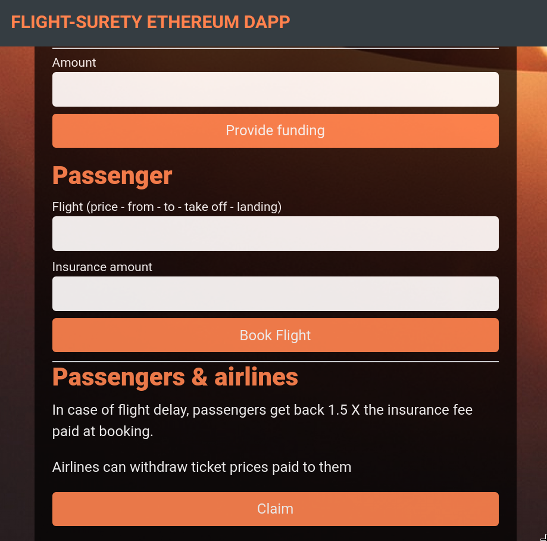

# FlightSurety
FlightSurety is an Ethereum DApp to manage flight insurances.


## User Stories
### Airlines
- Airlines can register other airlines.
- Airline can register flights **respecting following conditions**
(otherwise the transaction will be rejected):
  - Take Off date must be in the future.
  - Landing date must be later than take Off date.

- Airlines can withdraw amount credited to them following flight ticket purchases
by passengers.
- Airlines form a consortium governed according to the following rules:
  - Providing a funding of at least 10 ETH is required before registering flights
  or airlines.
  - Starting from a number of 4 airlines registered, consensus of 50% is required
  (votes of half of the registered airlines) for new airline registration
  - Consensus is not required to register flights

### Passengers
- Passengers can book flights that have been registered by airlines.  
- Passengers can subscribe insurance for an amount of up to 1 ETH.  
- Insured passengers get reimbursed 1.5 x their insurance amount if a flight is
delay due to airline's responsibility.  
This credited amount is not transferred automatically but has to be withdrawn by
insurees.

### Oracles
Oracles inform the smart contract whether the status of a flight.
Flight status is requested by submitting a corresponding request to the oracles.  
As soon as 3 oracles provides concurring opinion, the flight status is updated
accordingly.  
**Oracles are simulated**: they generate a random status code on the server side.

## Contract architecture
Data (flights, passengers, insurance amounts, airlines...) has been separated from application logic,
resulting in two separated contracts: FlightSuretyApp and FlightSuretyData.  
This offers the following benefits:
- a new 'App' contract can be deployed in the case of business rule changes (different oracle registration fee, funding fee, etc..) while the state of the data contract is kept.
- ensures modularity

## Getting Started
1.  Clone/download repository  
2.  Install dependencies
```
$ npm install
```
3.  Run tests
```
$ truffle develop
truffle(develop)> test
```
**Don't do** `ganache-cli` and then `truffle test`**!  
The tests would fail because of a different nounce error (I couldn't find out how to fix this).  
Run from the** `truffle(develop)>` **console and they will pass just fine.**

4.  Look for your mnemonic in your Metamask settings, write it in a `.secret` file, save it in the root folder.  
5.  Deploy locally  
Update the account argument depending on the number of addresses to load at start.
```
$ ganache-cli -m "$(cat .secret)" -a 50
```
In a new terminal:
```
$ truffle migrate
```
6.  Start front-end.  
In a new terminal:
```
$ npm run dapp
```
7.  Start server (for oracles and API).  
In a last terminal:
```
$ npm run server
```
8.  Use the app:
  - Go to http://localhost:8000/
  - First airline registered is the account 2 of your metamask accounts.
  - Provide funding of min 10 ETH from this address.
  - Register flights or (up to 3) new airlines from this address.
  - Switch to a 'passenger' address (e.g account 3) and book a flight.
  - 1st Airline/account 2 is now able to withdraw its credited ticket price.
  - Submit request to oracles (from which account doesn't matter)
  - If flight is delayed, passenger/account 3 can now withdraw his credited insurance amount.  

**NOTES:  
The browser needs to be refreshed in order for the drop-down selection lists (flight booking and oracle requests) to be updated.  
Refresh is also needed after switching accounts in Metamask.**

## API
The server runs by default on port 3000.  
- **/flights**  
Get all registered flights.  
Note: the front-end client get the registered flights from this end point.
- **/flight/ref.destination.landing_timestamp**  
Get one flight
- **/response/ref.destination.landing_timestamp**  
Get a response object (isOpen and requester attributes)

## Resources

- [Truffle](https://www.truffleframework.com/): smart contracts and DAPP development framework.
- [npm](https://www.npmjs.com/get-npm)
- [Metamask](https://metamask.io/): browser add-in to interact with the JavaScript Ethereum API [Web3](https://github.com/ethereum/web3.js/).
- [VanillaJS DOM class](https://hackernoon.com/how-i-converted-my-react-app-to-vanillajs-and-whether-or-not-it-was-a-terrible-idea-4b14b1b2faff)
- [CRUD pattern in solidity](https://medium.com/@robhitchens/solidity-crud-part-1-824ffa69509a)
