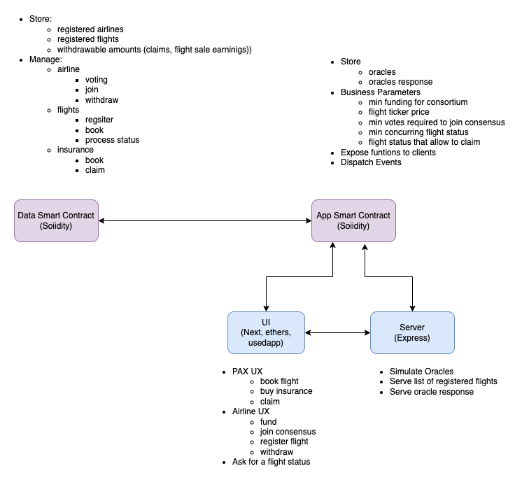
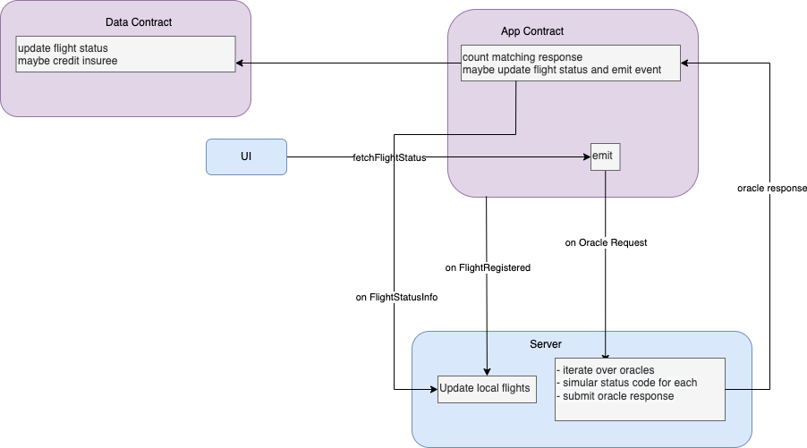

# FlightSurety

FlightSurety is an Ethereum DApp to manage flight insurances.

## User Stories

### Airlines

Airlines form a consortium:

- Providing a funding of at least 10 ETH is required to join
- Starting from a number of 4 airlines registered, consensus of 50% is required  (votes of half of the registered
  airlines) for new airline registration
- Consensus is not required to register flights

They can

- Register other airlines.
- Can register flights
- Withdraw amount credited to them following flight ticket purchases by passengers.

### Passengers

Passengers can:

- Book flights that have been registered by airlines.
- Subscribe insurance
    - This allows them to get reimbursed 1.5 x their insurance amount if a flight is delay due to airline's
      responsibility.
    - This credited amount is not transferred automatically but has to be withdrawn.

### Oracles

Oracles inform the smart contract about the status of a flight.  
Flight status is requested by submitting a corresponding request to the oracles.    
As soon as 3 oracles provides concurring opinion, the flight status is updated accordingly.  
**Oracles are simulated**: they generate a random status code on the server side.

## Architecture

Data (flights, passengers, insurance amounts, airlines...) has been separated from application logic,
resulting in two separated contracts: FlightSuretyApp and FlightSuretyData.  
This offers the following benefits:

- a new 'App' contract can be deployed in the case of business rule changes (different oracle registration fee, funding
  fee, etc..) while the state of the data contract is kept.
- ensures modularity

### System OVerview

### Flight Status Processing Workflow

## Getting Started

1. Clone/download repository
2. Install dependencies: `yarn`
3. Start local blockchain: `yarn anvil`
4. Deploy contracts: `yarn deploy`
5. Start server: `yarn start:server` (available on `http://localhost:3001`)  
   **API**

   | path        | method | request                                                          | response                   |
       |-------------|--------|------------------------------------------------------------------|----------------------------|
   | /flights    | GET    |                                                                  | List of registered flights |
   | /flight/:key | GET    |                                                                  | flight                     |
   | /response/:key| GET    |                                                                  | status code                |
   | /flight-key | POST   | { flightRef: string, from: string, to: string, takeOff: number } | flight key hash            |
6. Start UI: `yarn start:ui` ((available on `http://localhost:3000`))

## Server API

## Resources

- [Foundry](https://github.com/foundry-rs): Foundry is a blazing fast, portable and modular toolkit for Ethereum
  application development written in Rust.
- [CRUD pattern in solidity](https://medium.com/@robhitchens/solidity-crud-part-1-824ffa69509a)
